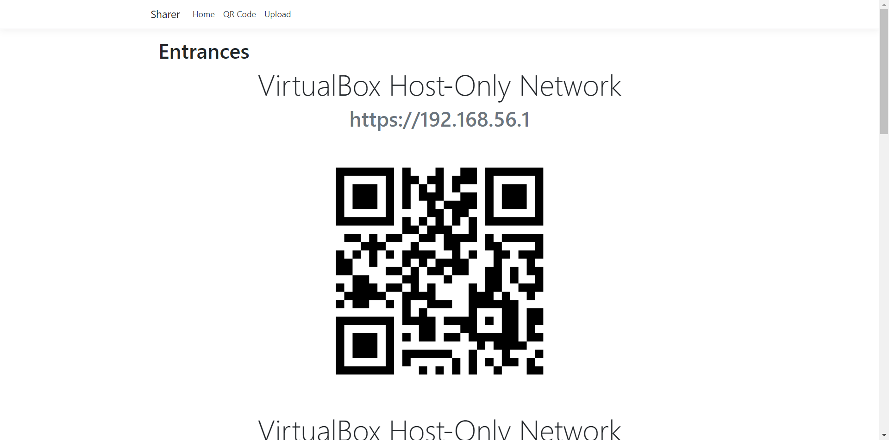
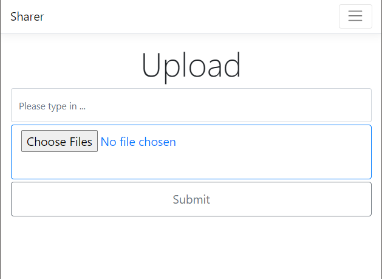

# Sharer

Share photo and text between any device and the APP host.

## Demo

### Server-side

### Client-side

## Warning

- About security
    - This app does NOT provide any security. Under HTTP protocol, the message sent is not encrypted, which might be safely passed in a trusted LAN or through a private hot spot.
    - If using SSL protocol, the certificate is self-signed. Before sending files, please make sure the public key fields of certificates in both client and server are identical.
- About performance
    - for project ["Sharer"](src/Sharer)
        - The file transfer is only performed by form posting.
    - for project ["SharerBlazorServer"](src/SharerBlazorServer)
        - The files are uploaded by chunks.

## Notices

The presumed `pwd` is [`src/Sharer`](src/Sharer) or [`src/SharerBlazorServer`](src/SharerBlazorServer).

## Build

This might cost a long time

    dotnet publish -r win-x64 -c Release /p:PublishSingleFile=true

## How to use

For Windows users:

> Don't relay on this method.

1. run `Launch.bat`
1. make sure your device is in the same LAN as your computer
1. let your device scan the QR code of the secure channel
1. send photo or text
1. check the photo in the popped-up file explorer or find the text in the console

For Linux + MacOS + Windows users:

- run `dotnet run`
- the folder `upload.user` (Sharer) or `Resources` (SharerBlazorServer) in the root of the project is where the files locate.

## TODO

- ~~[ ] Password + ban IP after excessive tries~~
- [ ] Add "Open download folder" on the QR page
- [x] Huge file transfer
    - on project ["SharerBlazorServer"](src/SharerBlazorServer)
- [x] Transfer through RESTful API
    - on project ["SharerBlazorServer"](src/SharerBlazorServer)
